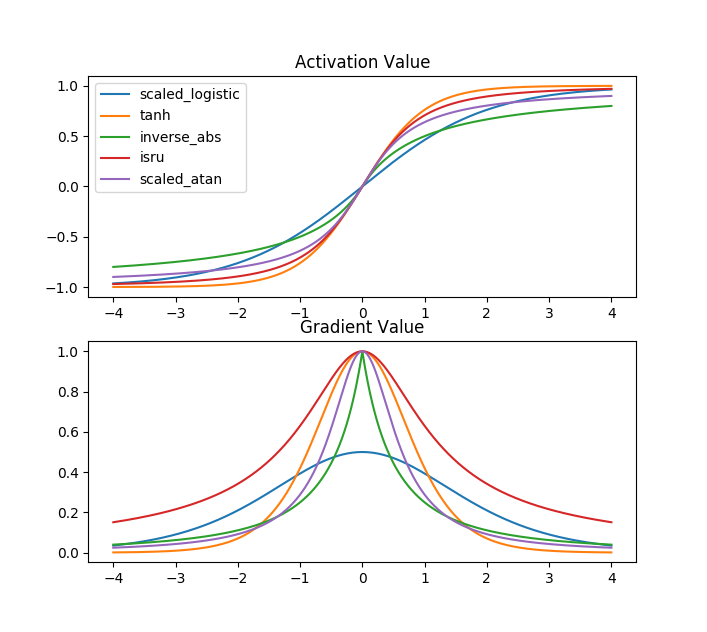

# 잡다한 꿀팁

### 로지스틱 함수의 수치 안정성(Numerical Stability)

시그모이드 함수의 가장 대중적인 형태인 로지스틱 함수는 아래와 같다.
$$
\sigma(x)=\dfrac{1}{1 +e^{-x}}
$$
이는 수학적으로는 전혀 문제가 없다. 그러나 $x \to -\infty$로 발산할 경우 지수함수에서 오버플로우가 발생한다. `numpy.exp`를 써서 구현했다면 최초 1회에 한해 경고만 뜨고 큰 문제를 일으키지 않지만, 오버플로우를 처리하지 못하는 상황에서 구현할 경우 오류가 발생할 수 있다. (ex: 파이썬 `math.exp`)

**지수 정규화 트릭(Exp-normalize trick, [참고](https://timvieira.github.io/blog/post/2014/02/11/exp-normalize-trick/))** 을 사용하면 수치 안정성을 더 향상시킬 수 있다. 이 트릭을 구현하는 방법은 간단한데, x의 범위에 따라서 해석적으로 동일한 서로 다른 계산법을 적용하는 것이다.
$$
\sigma(x) = \begin{cases}\dfrac{1}{1+e^{-x}}, &\mbox{if } x \ge 0\\ \dfrac{e^x}{e^x+1}, &\mbox{otherwise} \end{cases}
$$
이 트릭의 핵심은 $lim_{x \to -\infty}e^x=0$를 이용하는 것이다. $x \ge 0$이면 분자에 1이 있는 것을 사용하고, $x < 0$이면 분자에 $e^x$가 있는 것을 사용하면 된다. 이렇게 해서 얻을 수 있는 이점은 x가 매우 작은 음수인 경우에도 오버플로우가 발생하지 않는다는 점, 정상동작을 하는 범위가 좀 더 넓어진다는 점이 있다.

`numpy.exp` 기준 바닐라 로지스틱 구현은 약 $x = -709.78279989...$ 에서 오버플로우가 발생하며 함수 값은 정확히 0.0을 출력한다. 반면 트릭을 사용한 구현은 $x = -744.03469988...$ 에서 언더플로우가 발생한다. 여담으로 양수 범위에서 언더플로우가 발생하는 경계는 약 $x = 37.7369$ 이후로 함수 값은 정확히 1.0을 출력한다. 사용한 테스트 소스코드는 아래와 같다.

```python
import numpy as np

def sigmoid_vanilla(x):
    return 1.0 / (1.0 + np.exp(-x))

def sigmoid_safe(x):
    return np.where(x >= 0, sigmoid_vanilla(x), np.exp(x) / (np.exp(x) + 1.0))

# Proper boundary of the vanilla implementation
epsilon = np.array([1e-4])
x = np.array([0])
while sigmoid_vanilla(x) > 0.0:
    x = x - epsilon
print('vanilla: overflow occured near x = ' + str(x))

# Proper boundary of the tricked implementation
x = np.array([0])
while sigmoid_safe(x) > 0.0:
    x = x - epsilon
print('tricked: underflow occured near x = ' + str(x))

# Compute upper bound
x = np.array([0])
while sigmoid_vanilla(x) < 1.0:
    x = x + epsilon
print('underflow occured near x = ' + str(x))
```

물론 이 수치는 사용하는 언어나 환경, 지수함수의 구현 방식에 따라서 차이가 날 수 있으며, 오버플로우/언더플로우에 대한 대책 역시 달라지므로 상황에 맞게 적용하면 된다. 또한 이 방식을 사용하면 계산 비용이 증가한다는 것도 기억해야한다.

### 로지스틱 함수의 대체재

거의 모든 교재와 자료에서 시그모이드 함수는 로지스틱 함수를 의미하며, 둘을 동일시하기도 한다. 그러나 1995년 발표된 한 [논문](https://link.springer.com/chapter/10.1007%2F3-540-59497-3_175)에서는 모든 실수에서 미분 가능하며 유계인 단조증가함수로 시그모이드를 정의하였다.

이론 상(ex: 분류문제를 풀기 위해 Cross Entropy랑 엮이는 경우) 아귀가 맞는 것은 로지스틱 함수다. 그러나 실용적으로는 (-1, 1)의 범위를 갖는 S자 모양을 갖는 녀석이면, 필요에 따라 범위를 조절한 뒤 써도 문제가 없는 것으로 알려져있다.

굳이 다른 형태를 사용하는 주된 이유는 더 가파른 기울기를 얻기 위해서다. 수학적으로 다양한 형태의 시그모이드 함수가 존재하는데, 그 중 컴퓨터로 계산하기 적합한 것들을 그래프로 비교해보았다. 로지스틱은 치역이 (0, 1)이기 때문에, 2를 곱하고 1을 빼서 다른 아이들과 맞춰주었다. 역탄젠트도 마찬가지.



#### Hyperbolic Tangent(tanh)

$$
\sigma_{tanh}(x)=\dfrac{e^x-e^{-x}}{e^x+e^{-x}}
$$

쌍곡선 함수를 사용한 형태. 유독 많이 알려진 함수이기도 한데, 누가 언제부터 유행시켰는지는 알 수 없다. 시그모이드류 중 기울기가 가장 가파르다. 그러나 개인적인 견해로 tanh는 수치 안정성이 매우 떨어진다. 후술할 실험 결과에서 tanh는 정상 작동 범위가 약 $\pm1.87149\times 10^1$ 밖에 안된다. 이는 신경망이 툭하면 터질 수치에 해당된다.

#### Inverse Absolute Sigmoid

$$
\sigma_{abs}(x)=\dfrac{x}{1+|x|}
$$

절대값 함수를 사용한 형태. 이 함수의 이름은 정확히 알려져있지 않다. $x = 0$에서는 로지스틱 함수보다 기울기가 급하긴 한데, $0.4501\lesssim |x| \lesssim 3.7742$ 부근에선 오히려 로지스틱보다 기울기가 작다. 분모/분자 항의 차수가 1차라서 그런지 정상 작동 범위는 무려 $\pm9.0072\times10^{15}$나 된다.

#### Inverse Square Root Unit

$$
\sigma_{isru}(x)=\dfrac{x}{\sqrt{1+x^2}}
$$

분모가 제곱의 합에 제곱근을 씌운 형태. 2017년 발표된 [활성화 함수 관련 논문](https://arxiv.org/abs/1710.09967)에서 곁다리(?)로 제안되었다. 이 함수가 매력적인 이유는 '고속 역제곱근 계산(Fast Inverse Square Root)' 알고리즘의 존재 때문이다. 저자의 주장에 따르면, 역제곱근을 빠른 속도로 계산하는 이 알고리즘을 사용할 시 tanh보다 3~6배 정도 계산 시간을 단축할 수 있다. 기울기도 tanh에 비해 훨씬 급하므로 학습 효율이 더욱 우수할 것으로 예상된다.

해당 알고리즘을 사용하지 않고 `numpy`만 사용한 실험에서의 정상 작동 범위는 $\pm6.71088\times10^7$로 상당히 안정적이다.

#### Inverse Tangent(atan)

$$
\sigma_{atan}(x)=\dfrac{2}{\pi}tan^{-1}(\dfrac{\pi}{2}x)
$$

탄젠트의 역함수를 사용한 형태. 잡다한 상수가 많이 붙어있는 이유는 범위를 (-1, 1)로 맞춰주기 위함과 동시에 도함수 계산을 간편하게 하기 위해서다. 기울기는 tanh보다도 작지만 정상 작동 범위가 $\pm3.6958\times10^{15}$로 매우 안정적이다. 초창기에 잠깐 논의되고 사장된 함수로 보인다.

#### 각 함수들의 수치 안정성

Jun Han, Claudio Moraga가 정의한 시그모이드 함수의 조건에 따르면, 시그모이드 함수의 치역은 반드시 열린 집합이어야 한다. 그러나 무한히 크고 작은 수를 다룰 수 없는 컴퓨터의 특성 때문에, 현실에선 일정 범위를 넘어서면 치역에서 나올 수 없는 극한 값을 가질 수 있다. 가령 로지스틱 함수에 1e+10같은 매우 큰 수를 집어넣으면 당당하게 1.0을 출력하는 것을 확인할 수 있다.

이는 신경망의 전체 수치 안정성에 영향을 줄 수 있다. Cross Entropy같이 제한된 정의역을 가지는 계산 과정에서 시그모이드의 입력이 비정상적으로 크거나 작을 경우, inf나 NaN이 발생하여 신경망 전체를 먹통으로 만들 수 있다. 특히 시그모이드가 ReLU나 Leaky ReLU 다음 단에 물릴 경우 이런 현상이 발생할 가능성이 높다.

함수의 이론적인 치역 내의 값만 가지는 구간을 정상 작동 범위라고 정의하자. 아래의 (무식한) 소스코드를 사용하여 각 함수의 정상 작동 범위를 구할 수 있다.

```python
def sigmoid_range_test(fn, epsilon, y_lb=-1.0, y_ub=1.0):
    x = 0.0
    while fn(x) > y_lb:
        x -= epsilon
    lb = x
    x = 0.0
    while fn(x) < y_ub:
        x += epsilon
    ub = x
    return lb, ub
```

