# 잡다한 꿀팁

### 로지스틱 함수의 수치 안정성(Numerical Stability)

시그모이드 함수의 가장 대중적인 형태인 로지스틱 함수는 아래와 같다.

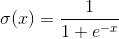

이는 수학적으로는 전혀 문제가 없다. 그러나 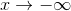로 발산할 경우 지수함수에서 오버플로우가 발생한다. `numpy.exp`를 써서 구현했다면 최초 1회에 한해 경고만 뜨고 큰 문제를 일으키지 않지만, 오버플로우를 처리하지 못하는 상황에서 구현할 경우 오류가 발생할 수 있다. (ex: 파이썬 `math.exp`)

**지수 정규화 트릭(Exp-normalize trick, [참고](https://timvieira.github.io/blog/post/2014/02/11/exp-normalize-trick/))** 을 사용하면 수치 안정성을 더 향상시킬 수 있다. 원래 이 트릭은 Softmax나 LogSumExp를 안정화시키는데 쓰인다. 원리는 분모분자에 똑같은 수를 곱해도 해석적으로 동일한 수임을 이용한다. 로지스틱에 이 트릭을 적용하는 법은 간단한데, x의 범위에 따라서 해석적으로 동일한 서로 다른 계산법을 적용하는 것이다.

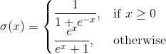

핵심은 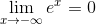를 이용하는 것이다. 이렇게 해서 얻을 수 있는 이점은 x가 매우 작은 음수인 경우에도 오버플로우가 발생하지 않는다는 점, 정상동작을 하는 범위가 좀 더 넓어진다는 점이 있다.

`numpy.exp` 기준 바닐라 로지스틱 구현은 약 에서 오버플로우가 발생하며 함수 값은 정확히 0.0을 출력한다. 반면 트릭을 사용한 구현은 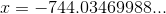 에서 언더플로우가 발생한다. 여담으로 양수 범위에서 언더플로우가 발생하는 경계는 약 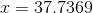 이후로 함수 값은 정확히 1.0을 출력한다. 사용한 테스트 소스코드는 아래와 같다.

```python
import numpy as np

def sigmoid_vanilla(x):
    return 1.0 / (1.0 + np.exp(-x))

def sigmoid_safe(x):
    return np.where(x >= 0, sigmoid_vanilla(x), np.exp(x) / (np.exp(x) + 1.0))

# Proper boundary of the vanilla implementation
epsilon = np.array([1e-4])
x = np.array([0])
while sigmoid_vanilla(x) > 0.0:
    x = x - epsilon
print('vanilla: overflow occured near x = ' + str(x))

# Proper boundary of the tricked implementation
x = np.array([0])
while sigmoid_safe(x) > 0.0:
    x = x - epsilon
print('tricked: underflow occured near x = ' + str(x))

# Compute upper bound
x = np.array([0])
while sigmoid_vanilla(x) < 1.0:
    x = x + epsilon
print('underflow occured near x = ' + str(x))
```

물론 이 수치는 사용하는 언어나 환경, 지수함수의 구현 방식에 따라서 차이가 날 수 있으며, 오버플로우/언더플로우에 대한 대책 역시 달라지므로 상황에 맞게 적용하면 된다. 또한 이 방식을 사용하면 계산 비용이 증가한다는 것도 기억해야한다.

------

### 로지스틱 함수의 대체재

거의 모든 교재와 자료에서 시그모이드 함수는 로지스틱 함수를 의미하며, 둘을 동일시하기도 한다. 그러나 1995년 발표된 한 [논문](https://link.springer.com/chapter/10.1007%2F3-540-59497-3_175)에서는 모든 실수에서 미분 가능하며 유계인 단조증가함수로 시그모이드를 정의하였다.

이론 상(ex: 분류문제를 풀기 위해 Cross Entropy랑 엮이는 경우) 아귀가 맞는 것은 로지스틱 함수다. 그러나 실용적으로는 (-1, 1)의 범위를 갖는 S자 모양을 갖는 녀석이면, 필요에 따라 범위를 조절한 뒤 써도 문제가 없는 것으로 알려져있다.

굳이 다른 형태를 사용하는 주된 이유는 더 가파른 기울기를 얻기 위해서다. 수학적으로 다양한 형태의 시그모이드 함수가 존재하는데, 그 중 컴퓨터로 계산하기 적합한 것들을 그래프로 비교해보았다. 로지스틱은 치역이 (0, 1)이기 때문에, 2를 곱하고 1을 빼서 다른 아이들과 맞춰주었다. 역탄젠트도 마찬가지.


#### Hyperbolic Tangent(tanh)

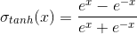

쌍곡선 함수를 사용한 형태. 유독 많이 알려진 함수이기도 한데, 누가 언제부터 유행시켰는지는 알 수 없다. 시그모이드류 중 기울기가 가장 가파르다. 그러나 개인적인 견해로 tanh는 수치 안정성이 매우 떨어진다. 후술할 실험 결과에서 tanh는 정상 작동 범위가 약 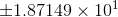 밖에 안된다. 이는 신경망이 툭하면 터지는 수치에 해당된다.

#### Inverse Absolute Sigmoid


절대값 함수를 사용한 형태. 이 함수의 이름은 정확히 알려져있지 않다. 에서는 로지스틱 함수보다 기울기가 급하긴 한데,   부근에선 오히려 로지스틱보다 기울기가 작다. 분모/분자 항의 차수가 1차라서 그런지 정상 작동 범위는 무려 나 된다.

#### Inverse Square Root Unit(ISRU)


분모가 제곱의 합에 제곱근을 씌운 형태. 2017년 발표된 [활성화 함수 관련 논문](https://arxiv.org/abs/1710.09967)에서 곁다리(?)로 제안되었다. 이 함수가 매력적인 이유는 '고속 역제곱근 계산(Fast Inverse Square Root)' 알고리즘의 존재 때문이다. 저자의 주장에 따르면, 역제곱근을 빠른 속도로 계산하는 이 알고리즘을 사용할 시 tanh보다 3~6배 정도 계산 시간을 단축할 수 있다. 기울기도 tanh에 비해 훨씬 급하므로 학습 효율이 더욱 우수할 것으로 예상된다.

해당 알고리즘을 사용하지 않고 `numpy`만 사용한 실험에서의 정상 작동 범위는 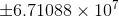로 상당히 안정적이다.

#### Inverse Tangent(atan)

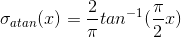

탄젠트의 역함수를 사용한 형태. 잡다한 상수가 많이 붙어있는 이유는 범위를 (-1, 1)로 맞춰주기 위함과 동시에 도함수 계산을 간편하게 하기 위해서다. 기울기는 tanh보다도 작지만 정상 작동 범위가 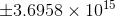로 매우 안정적이다. 초창기에 잠깐 논의되고 사장된 함수로 보인다.

#### 각 함수들의 수치 안정성

Jun Han, Claudio Moraga가 정의한 시그모이드 함수의 조건에 따르면, 시그모이드 함수의 치역은 반드시 열린 집합이어야 한다. 그러나 무한히 크고 작은 수를 다룰 수 없는 컴퓨터의 특성 때문에, 현실에선 일정 범위를 넘어서면 치역에서 나올 수 없는 극한 값을 가질 수 있다. 가령 로지스틱 함수에 1e+10같은 매우 큰 수를 집어넣으면 당당하게 1.0을 출력하는 것을 확인할 수 있다.

이는 신경망의 전체 수치 안정성에 영향을 줄 수 있다. Cross Entropy같이 제한된 정의역을 가지는 계산 과정에서 시그모이드의 입력이 비정상적으로 크거나 작을 경우, inf나 NaN이 발생하여 신경망 전체를 먹통으로 만들 수 있다. 특히 시그모이드가 ReLU나 Leaky ReLU 다음 단에 물릴 경우 이런 현상이 발생할 가능성이 높다.

함수의 이론적인 치역 내의 값만 가지는 구간을 정상 작동 범위라고 정의하자. 아래의 (무식한) 소스코드를 사용하여 각 함수의 정상 작동 범위를 구할 수 있다.

```python
def sigmoid_range_test(fn, epsilon, y_lb=-1.0, y_ub=1.0):
    x = 0.0
    while fn(x) > y_lb:
        x -= epsilon
    lb = x
    x = 0.0
    while fn(x) < y_ub:
        x += epsilon
    ub = x
    return lb, ub
```

------

### Cross Entropy의 수치 안정성 및 Softmax와의 결합

분류 문제를 풀기 위해 이 둘을 조합하는 것은 매우 일반적이다. 하지만 Softmax와 Cross Entropy를 따로 구현한 뒤 합칠 경우 수치적으로 불안정할 수 있다.

Cross Entropy Loss의 계산식은 아래와 같다. 이때 의 원소의 합은 반드시 1이어야 한다. (확률을 구하는 것이기 때문)


이를 추정값 에 대하여 미분한 결과는 다음과 같다.

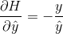

Cross Entropy를 단독으로 사용할 경우, 가 0이 되면 Cross Entropy는 NaN이나 -inf를 뱉으면서 신경망 학습을 마비시킨다. 이런 상황은 매우 일상적인데, Softmax에 극단적인 값(ex: (800, 0, 0))을 넣으면 나와선 안되는 값인 0.0과 1.0이 나온다. 안전하게 로그 안에 작은 수 ε을 더해주는 방법도 있지만 이론적으로 더 깔끔한 방법이 있다.

Softmax의 계산식과 미분값은 아래와 같다.

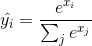

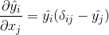

만약 Softmax와 Cross Entropy를 합칠 경우 그라디언트는 아래와 같다.

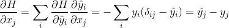

중간 과정은 매우 복잡하지만, 결과는 아주 단순하다. 그렇다면 굳이 나눠서 귀찮게 계산할 필요가 있을까? 계산 시간도 오래 걸리고, 지수함수와 로그함수를 거치면서 수치 안정성도 매우 떨어질 것이다.

역전파 결과가 이렇게 간단하게 나온다면, 순전파도 합쳐볼 수 있지 않을까? 계산하면 다음과 같다.

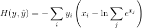

여전히 지수 계산을 해야한다는 것은 변함이 없지만, 지수 스케일의 나눗셈을 뺄셈으로 교체한 것은 큰 의미가 있다. 괄호 안에 있는 것을 **Log Sum Exp(LSE)** 라고 부른다. 하지만 이대로 사용하면 오버플로우 경계선은 원래 Softmax와 다르지 않다. 따라서 로지스틱 안정화에서 언급했던 Exp-Normalize 트릭을 사용하여 다음과 같이 구현하는 것이 좋다.

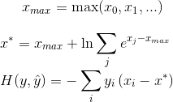

원소의 최대값을 빼면 지수부의 상계(Upper Bound)가 0이 되어 오버플로우가 일어날 수 없다. 또한 로그 내부의 값은 항상 1보다 같거나 크므로 마이너스 무한대도 볼 일이 없다. 아주 훌륭한 트릭이라 할 수 있다.

단, 이 방법으로 구현을 하더라도 역전파 때 사용하기 위해 softmax의 출력값은 구해야한다. 다행히 x*을 구하는 과정에서 값을 재사용할 수 있으므로 걱정할 필요는 없다. 이 역시 Exp-Normalize 트릭을 사용하여 구현한다.

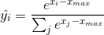