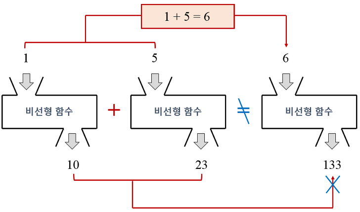
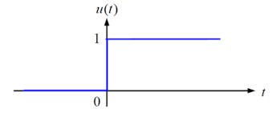
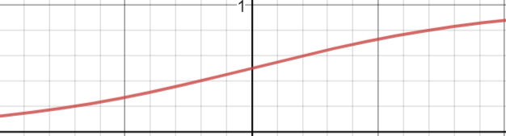
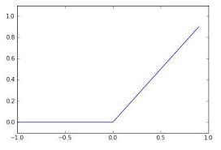

# 2주차 수업:  신경망

## 목차

1. 신경망이란?
2. Jupyter 를 사용한 DeepLearning

## 신경망 개요

신경망이란 가중치 매개변수의 적절한 값을 데이터로부터 자동을 학습하는 능력을 가진 함수이다.

앞서 공부한 퍼셉트론을 생각해보자 퍼셉트론은 수동으로 가중하고(원하는 값이 나올 때 까지 수동으로 값을 수동으로 설정한다.) 확인해야 했다.

## 단순한 신경망

신경망을 그림으로 나타내면 (책 p.64 그림 3-1) 입력층 은닉층 출력층이 있다. 은닉충은 블랙박스로 우리가 볼 수 없고 우리 눈에 보이는 신경망은 입력층과 출력층이다.

입력층은 말 그대로 원하는 값을 넣고 출력층은 은닉층을 거쳐 가공된 값이 나오는 층이다. 이때, 활성화 함수가 등장하는데, 이 활성화 함수는 비선형 함수를 주로 사용한다. 이는 선형함수를 사용하는 경우, 층을 늘려도 결국 결과가 동일해 지기 때문이다.

기본적인 개념은 책에서 설명하기 때문에 단순하게 책에 안나온 부분을 설명하고 넘어가면

### 비선형 함수



[선형함수란, 예측이 가능한 (직선 하나로 표현 가능한) 간단한 선형함수의 예를 python 코드로 설명 작성했다.]

단순하게 비선형 함수 = 직선이 아닌 함수 라고 생각을 하면 된다.

### 계단함수



위는 계단함수의 한 예 이다. 마치 연속된 가우스 함수처럼 보인다.

### 시그모이드 함수

$$
h(x)=\frac{1}{1+exp(-x)}
$$

로지스틱 함수라고도 불리는 시그모이드 함수는 위의 식을 의미한다 (여기서 exp = e)



그래프는 위와 같이 그려지며 해당 부분은 [-2, 2] 의 범위를 캡쳐한 것이다.

### ReLU 함수



요즘 주로 사용하는 함수라고 책에서 소개하고 있다. Full name 은 Rectified Linear Unit이다.

numpy 에서는 maximum 함수를 사용하는데 maximum(x,y) 함수는 입력된 x 와 y 중 큰 값을 return 하기 때문에

```python
maximum(0,x)
```

위와 같은 maximum 함수는 ReLU 함수중 하나이고

exmaple)

```python
x = maximum(0,3) # x 는 3
y = maximum(0, -1) # y는 0
```

위와 같은 결과를 예측할 수 있다.

### 행렬

행렬에 대한 내용은 책에 서술되어 잇으니 작성하지 않고, 신경망에서의 행렬에 대해서 코드로 확인해보자

행렬을 배열에 대입하면 상당히 편한데 기존의 행렬은 아래와 같이 구현이 가능하다.

```python
array = [[1,2,3],[4,5,6]]
```

위와 같은 모양은
$$
\begin{pmatrix} 1 & 2 & 3\\ 4 & 5 & 6 \end{pmatrix}
$$
과 같은 배열일 것이다. 그리고 이는 numpy 에서

```python
array = np.array([1,2,3],[4,5,6])
```

과 같이 사용할 수 있다. 이 행렬을 신경망이라고 하고, numpy를 이용해서 신경망 계산을 해보면

```python
y = np.dot(x, array)
```

으로 표현가능 할 것이다. 기존의 수동으로 하는 방식이라면 행렬 곱을 구하고, 그것을 가중치로 하여 X 와 Y를 구하겠지만 numpy는 자동으로 해준다 와!